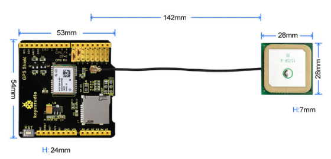
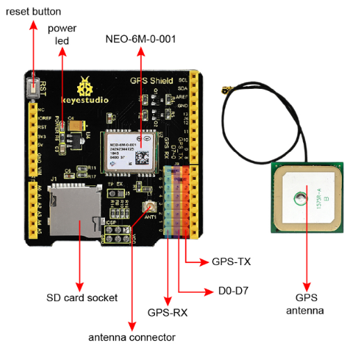
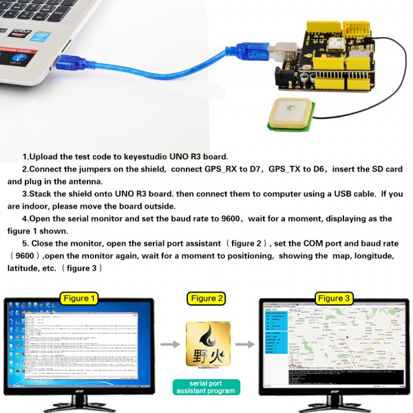
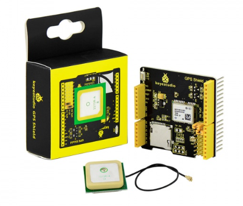

# KS0253 keyestudio GPS Shield


## 1. Introduction

In life, it is becoming more and more popular to use GPS positioning. As for arduino MCU DIY experiments, is there a GPS positioning shield that can be compatible with the Arduino MCU?

Well, use this keyestudio GPS shield. It is based on the NEO-6M-0-001 module, and those pins are also compatible with UNO R3 and MEGA 2560 control board.

Regular GPS pins (RX, TX) is connected to Arduino D0-D7, and you are able to set the connection pin via the jumper cap.

An active antenna is mounted on the GPS shield, allowing you to find your exact location within a few meters. Meanwhile, GPS also provides you with very accurate time!

It can be used in car navigation, personal positioning, fleet management, navigation and navigation.

In particular, this expansion board can only be positioned outdoors and cannot be used for indoor positioning.

## 2. You can check out these features

- Using an active GPS antenna
- Connecting TxD and RxD to Arduino pins (D0-D8 optional) with jumper, and the default jumper caps are D7<-->RX and D6<-->TX.
- Onboard comes with a SD card socket
- Comes with an ICSP pin
- Comes with a reset button to reset the Arduino control board

## 3. Technical Details

- GPS shield dimensions: 54mm*53mm*24mm
- Antenna dimensions: 28mm*28mm*7mm
- Antenna lead length: 142mm
- Weight: 32g



## 4. PINOUT



## 5.Test Code

**Library files and code download：**[Resources](./Resources.7z)

```c
/*
  Demo code for GPS Shield
  It records the GPS information onto the TF card, 
  and display on serial monitor as well.
  
  http://makerstudio.cc
*/
#include <SD.h>
#include <SPI.h>
#include <SoftwareSerial.h>
const int chipSelect = 10;
SoftwareSerial mySerial(6,7);//(RX,TX), (6->GPS_TX,7->GPS_RX)
void setup()
{
  Serial.begin(9600);
  mySerial.begin(9600);
  
  pinMode(10, OUTPUT);
  if (!SD.begin(chipSelect)) {  
    return;
  } 
}

void loop()
{
  // make a string for assembling the data to log:
  char index = 0;
  char temp = 0;
  String dataString = ""; 
  // open the file. note that only one file can be open at a time,
  // so you have to close this one before opening another.
  File dataFile = SD.open("datalog.txt", FILE_WRITE);
  if(dataFile)
  {
	while(mySerial.available())
	{
		temp = mySerial.read();
		Serial.print(temp);
		dataString += String(temp);
		index++;
		if(index>200)
			break;
	}
	dataFile.print(dataString);
	dataFile.close();
  }
  else
  {
	Serial.println("Open file failed");
  }
} 
```

## 6. Example Use

- Upload the test code to keyestudio UNO R3 board.
- Connect the jumpers on the shield, connect GPS_RX to D7, GPS_TX to D6, insert the SD card and plug in the antenna.
- Stack the shield onto UNO R3 board. then connect them to computer using a USB cable. If you are indoor, please move the board outside.
- Open the serial monitor, and set the baud rate to 9600, wait for a moment, displaying as the figure 1 shown.
- Close the monitor, open the serial port assistant, set the COM port and baud rate to 9600, then open the monitor again, wait for a moment for positioning, it will show the map, longitude, latitude, etc. (figure 3)

Download the serial port assistant from the link:
https://drive.google.com/open?id=1tufjM42WegNL3w_D4rUy9jkDwQS7cLgb



## 7. Package Includes

- Keyestudio GPS Shield *1pcs
- Antenna line *1pcs

